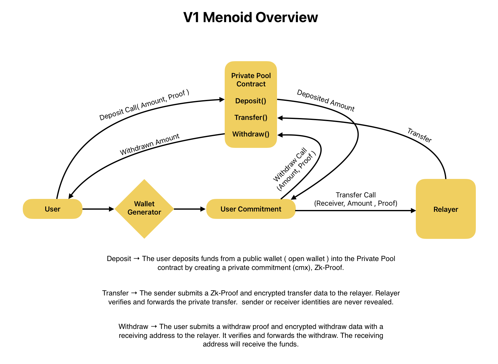
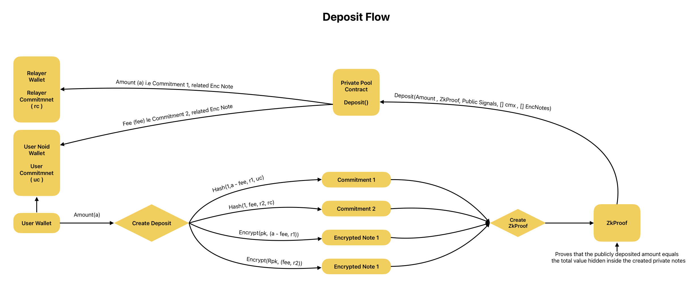
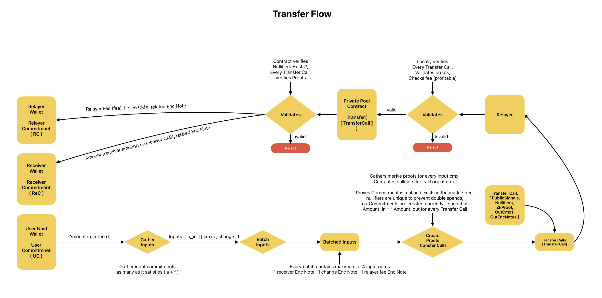
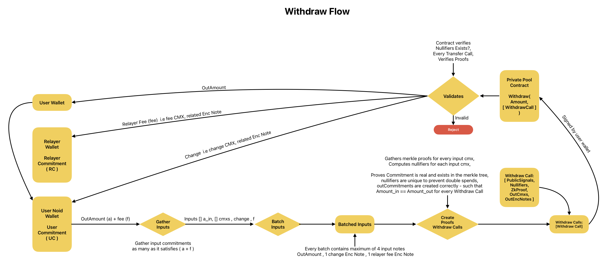

# 🔐 Menoid — A Private Crypto Wallet

> Introducing Privacy for the Multi-Chain World
>
> https://menoid.xyz

---

## Table of Contents

- [What is Menoid](#what-is-menoid)
  - [Why Privacy Matters](#why-privacy-matters)
  - [Crypto is multi-chain. Privacy isn't.](#crypto-is-multi-chain-privacy-isnt)
  - [Introducing Menoid](#introducing-menoid)
  - [Open Mode vs Noid Mode](#open-mode-vs-noid-mode)
  - [Privacy with Accountability](#privacy-with-accountability)
  - [The Future of Privacy](#the-future-of-privacy)
  - [Coming Up](#coming-up)
- [Core Vocabulary](#core-vocabulary)
- [1. Noid Mode Registration](#1-noid-mode-registration)
- [2. Overview](#2-overview)
- [3. Deposit](#3-deposit)
- [4. Transfer](#4-transfer)
- [5. Withdraw](#5-withdraw)
- [Appendix A — Protocol Constants](#appendix-a--protocol-constants)
- [Appendix B — Formula Reference](#appendix-b--formula-reference)

---

# What is Menoid

## Why Privacy Matters

Privacy is a fundamental part of everyday life.

We close our doors, protect our passwords, and don't publicly share every financial decision we make. Yet in crypto, most activity remains completely transparent by default. A single wallet address can reveal transaction history, asset holdings, NFT collections, DeFi positions, and interactions across protocols. Anyone with access to a block explorer can follow this information indefinitely.

Privacy is not about hiding wrongdoing. It is about preserving choice, security, and personal freedom in a digital world.

## Crypto is multi-chain. Privacy isn't.

Today, users interact across more blockchains than ever before. They trade on Solana, hold assets on Ethereum, explore new ecosystems like Monad, and use applications across countless networks.

Most privacy solutions, however, remain confined to individual ecosystems. While some focus on specific chains and others provide only limited privacy guarantees, users are often forced to rely on different tools as they move across the crypto landscape.

**Users have become multi-chain. Privacy has not.**

## Introducing Menoid

We believe privacy should not be limited by chain boundaries.

Instead of building privacy for a single ecosystem, we are building a private crypto wallet for the multi-chain world.

Menoid allows users to access privacy across multiple blockchain ecosystems from a single place, without forcing them to learn a different privacy model every time they switch chains.

Whether users are on Monad, Ethereum, Solana, Base, Sui, Aptos, Arbitrum, Polygon, or any other network, privacy should remain a consistent part of the experience.

Users don't think in chains anymore. And privacy shouldn't either.

The goal is simple:

- **One wallet.**
- **One privacy experience.**
- **Multiple chains.**

> This is not just a design goal — it is what the protocol actually does. The same identity derivation, the same commitment formula, and the same nullifier formula are implemented on EVM chains (Solidity), Solana (Rust/Anchor), Aptos (Move), and Sui (Move). One signature from your wallet produces the same Noid identity everywhere.

## Open Mode vs Noid Mode

Menoid is one wallet with two modes. The user chooses how visible they want to be.

| | **🌍 Open Mode** — public on-chain | **🌑 Noid Mode** — privacy by default |
|---|---|---|
| **Balances** | Public — anyone can read them | Hidden |
| **Transfers** | Public transfers | Private transfers |
| **Swaps** | Public swaps | Private swaps |
| **Bridges** | Public bridges | Private bridges |
| **History** | Permanently traceable | Untraceable |
| **Assets** | Public asset management | Private asset management |
| **Other** | dApp connectivity, NFT management | And more |

**Open Mode** is your regular wallet, behaving exactly as you expect: a normal address, normal transactions, fully visible on any block explorer. Nothing is hidden and nothing is changed.

**Noid Mode** is the private side of the same wallet. Your funds live inside a shielded pool as encrypted notes. Balances, senders, receivers, and amounts are never revealed on-chain — the chain only ever verifies mathematical proofs that the rules were followed.

Crucially, **both modes belong to the same wallet address**. You do not create a second wallet, you do not manage a second seed phrase, and you never see a second address. Moving between Open Mode and Noid Mode is a deposit or a withdrawal, not a migration.

## Privacy with Accountability

Privacy should not require users to choose between confidentiality and transparency.

Menoid is designed around the idea that users should control who can access their financial activity.

Through **viewing keys**, users can selectively share information with trusted parties when needed. This allows users to maintain privacy in their day-to-day activity while retaining the ability to provide transparency for audits, compliance requirements, accounting, or other legitimate purposes.

Rather than exposing financial activity to everyone by default, Menoid enables **privacy as the default and transparency as a choice**.

## The Future of Privacy

We believe privacy should become a natural part of the crypto experience, not an additional tool users must seek out.

As crypto continues to evolve into a multi-chain world, privacy should evolve with it.

## Coming Up

| Release | Description | Network |
|---|---|---|
| **V1 — Cohort 1** | Early Access (Extension) — the first early access beta of Menoid, available to early users and contributors. | Testnet |
| **V1 — Cohort 2** | Private Beta (iOS & Android) — bringing the Menoid experience to mobile for a limited group of users. | Testnet |
| **V1 — Cohort 3** | Open Beta (iOS & Android) — bringing the Menoid experience to mobile for everyone. | Testnet |
| **V2 & V3** | Mainnet — more updates coming soon. | Mainnet |

---

# Core Vocabulary

These terms appear throughout every section. Each section below also re-defines the terms specific to its own diagram.

| Term | Definition |
|---|---|
| **Open Mode** | The public side of the wallet. Your regular address and regular transactions, fully visible on-chain. |
| **Noid Mode** | The private side of the wallet. Balances and activity are hidden; the chain verifies proofs instead of reading values. |
| **Regular Wallet** | The user's existing wallet (MetaMask, Phantom, etc.). The only address a user ever sees or shares. Also called the *real wallet* or *open wallet*. |
| **Wallet Generator** | The deterministic derivation step that turns one wallet signature into the Noid Mode keys. It generates keys — it does *not* create a new wallet or a new address. |
| **Spending Key Pair** | A BabyJubJub keypair `(sk, spendPk)` derived from the signature. `sk` proves ownership of notes inside zero-knowledge proofs. |
| **Encryption Key Pair** | A secp256k1 keypair derived from the same signature, used only to encrypt and decrypt notes off-chain. It is never an on-chain account. |
| **User Commitment (uc)** | `Poseidon(walletAddress, spendPk.x, spendPk.y)`. Your Noid Mode identity — a single field element that binds your real address to your spending key. |
| **Note** | A private UTXO: an `(amount, randomness)` pair owned by a user commitment. Notes are the unit of value in Noid Mode. |
| **Commitment (cmx)** | The on-chain, public fingerprint of a note: `Poseidon(1, amount, randomness, userCommitment)`. Reveals nothing about amount or owner. |
| **Nullifier** | `Poseidon(2, commitment, randomness, sk)`. Published when a note is spent, to prevent double-spending. Only the owner can compute it. |
| **Encrypted Note** | The note's `(amount, randomness)` encrypted to the owner's encryption public key, emitted in an event so the owner can find and decrypt it. |
| **Private Pool Contract** | `NoidPool` — the contract holding the funds, verifying the proofs, tracking commitments and nullifiers. |
| **Relayer** | A service that submits private transactions on the user's behalf and pays the gas, so the user's public address never touches the pool. Paid in private fee notes. |
| **Relayer Commitment (rc)** | The relayer's own user commitment. Fixed at deployment and enforced by every circuit. |
| **ZK-Proof** | A Groth16 zero-knowledge proof. Proves the rules were followed without revealing the private values. |
| **Poseidon** | A ZK-friendly hash function. Cheap to compute inside a circuit, which is why it is used instead of Keccak. |
| **Merkle Tree** | An append-only tree of commitments. Proving your note is in the tree proves it exists without saying which note is yours. |
| **Public Signals** | The inputs to a proof that are visible on-chain. Everything else stays private. |

---

# 1. Noid Mode Registration


Registration is the one-time step that gives an Open Mode wallet a Noid Mode identity. It happens once per wallet, per chain, and everything after it — deposit, transfer, withdraw — depends on it.

## Definitions for this section

| Term | Definition |
|---|---|
| **Open Mode** | Your regular wallet as it exists today: a **Private Key** and a **Public Key**, a normal address, everything public on-chain. This is the starting point of the diagram. |
| **Sign("Message")** | The regular wallet signs one fixed, constant string: `menoid_Wallet`. This is a signature, not a transaction — it costs no gas and touches no chain. |
| **Result** | The resulting signature bytes. Because ECDSA signing over a fixed message with a fixed key is deterministic, the same wallet always produces the same signature. This makes it usable as a **seed**. |
| **Wallet Generator** | The pure function that expands the signature into two independent keypairs. Deterministic: same signature in, same keys out, forever. |
| **Spending PrivateKey / Spending PublicKey** | The **BabyJubJub** keypair. `sk` is the secret that authorizes spending; `spendPk = sk · Base8` is its public point `(x, y)`. |
| **BabyJubJub** | An elliptic curve chosen specifically because it is *embedded* in the BN254 field used by the proving system. Scalar multiplication on it is cheap inside a circuit, so a proof can recompute `spendPk` from `sk` and verify ownership on the spot. |
| **User Commitment** | `Poseidon(Regular Wallet Address, Spending PublicKey.x, Spending PublicKey.y)` — the single value that represents you in Noid Mode. |
| **Register OnChain** | A one-time transaction storing `Wallet Address : User Commitment` in the contract's public `registered` map. |

## How the derivation works

```
                     sign("menoid_Wallet")
   Regular Wallet  ─────────────────────────►  signature  (the seed)
                                                   │
                        ┌──────────────────────────┴──────────────────────────┐
                        │                  Wallet Generator                   │
                        └──────────────────────────┬──────────────────────────┘
                                                   │
              ┌────────────────────────────────────┴────────────────────────────────┐
              ▼                                                                      ▼
   sk = keccak256("menoid/spend" ‖ signature) mod l           encPriv = keccak256("menoid/encryption" ‖ signature)
   spendPk = sk · Base8            (BabyJubJub)               encPub  = secp256k1_derive(encPriv)
              │                                                                      │
              └──────────────────────┬───────────────────────────────────────────────┘
                                     ▼
       user_commitment = Poseidon(walletAddress, spendPk.x, spendPk.y)
                                     │
                                     ▼
                        register(user_commitment)      ← one-time, on-chain
```

Where `l` is the BabyJubJub prime subgroup order:

```
2736030358979909402780800718157159386076813972158567259200215660948447373041
```

The two domain separators — `"menoid/spend"` and `"menoid/encryption"` — guarantee that the spending key and the encryption key are independent. Learning one tells you nothing about the other.

## The two keypairs, and why there are two

| | **Spending keypair** | **Encryption keypair** |
|---|---|---|
| **Curve** | BabyJubJub | secp256k1 |
| **Purpose** | Prove ownership *inside* a ZK circuit; derive nullifiers | Encrypt/decrypt note contents (ECIES) *outside* the chain |
| **Ever an on-chain account?** | No | No |
| **Why this curve?** | SNARK-friendly — verifiable inside a proof | Standard, well-supported ECIES encryption |

They are separate because they do different jobs in different places. The spending key lives inside the arithmetic of a proof. The encryption key lives in ordinary software, wrapping notes so only their owner can read them.

## The User Commitment

```
user_commitment = Poseidon(walletAddress, spendPk.x, spendPk.y)
```

This one value carries the whole design:

- **It contains your real address**, which is why other users can pay you by simply typing your normal wallet address. The sender looks up `registered[yourAddress]` on-chain and locks the note to whatever commitment they find. No special "private address" is ever exchanged.
- **It contains your spending public key**, which is what makes it *yours*. Inside a circuit, the prover supplies `sk` and `owner_address`, recomputes `spendPk = BabyPbk(sk)`, and then recomputes the user commitment. If the result doesn't match the one the notes are locked to, the proof fails. Knowing someone's address is not enough to spend their notes — you would need their `sk`.
- **It is a hash**, so publishing it reveals neither your spending key nor anything about your holdings.

## Register on-chain

```solidity
function register(bytes32 userCommitment) external {
    require(userCommitment != bytes32(0), "Invalid user commitment");
    require(registered[msg.sender] == bytes32(0), "Already registered");

    registered[msg.sender] = userCommitment;
    emit WalletRegistered(msg.sender, userCommitment);
}
```

- **One-time only.** A second `register()` from the same address reverts with `Already registered`. The binding between an address and its Noid identity is permanent, so nobody — including you — can re-point an address at a different identity later.
- **Called by the real wallet.** `msg.sender` *is* the binding. There is no way to register a commitment on behalf of an address you don't control.
- **The relayer registers too**, at deployment time. Its commitment is stored as the immutable `relayerCommitment` and is baked into every circuit as a public input.

## What registration reveals — and what it doesn't

Registration is a public transaction, so it is observable that a given address has enabled Noid Mode. That is all it says. It does not reveal:

- your spending key or encryption key,
- your balance (you have none in the pool yet),
- any past, present, or future activity inside the pool.

## Why derive from a signature instead of generating a new wallet?

This is the central UX decision of the architecture, and it is worth stating plainly:

- **No second address.** Earlier designs derived a separate "noid wallet", and users reasonably concluded they had two wallets and got confused about which one held their money. Now you only ever see your real address.
- **No second seed phrase.** There is nothing extra to back up.
- **Deterministic recovery.** Install the extension on a new device, sign `menoid_Wallet` again, and the identical keys reappear. Your notes are recoverable from chain events alone.
- **Same identity on every chain.** The same derivation runs on EVM, Solana, Aptos, and Sui.

> **⚠️ The signature is the master secret.** Anyone who obtains the `menoid_Wallet` signature can derive both keypairs and spend every note you own. Menoid never transmits it. Never sign this message on an untrusted site, and treat the signature exactly as you would treat your seed phrase.

---

# 2. Overview



With registration done, the user has a Noid identity. This section is the map of the whole system: three operations against one contract, with a relayer standing between the user and the chain.

## Definitions for this section

| Term | Definition |
|---|---|
| **User** | The person, holding a regular Open Mode wallet with public funds. |
| **Wallet Generator** | The derivation from Section 1, which turns the user's signature into their Noid keys. |
| **User Commitment** | The user's Noid Mode identity. Everything the user owns inside the pool is locked to this value. |
| **Private Pool Contract** | The shielded pool: `NoidPool`. It holds the actual funds and exposes exactly three operations — `Deposit()`, `Transfer()`, `Withdraw()`. |
| **Deposit()** | The public entry point. Funds move from the open wallet into the pool, becoming private commitments. |
| **Transfer()** | Private movement *inside* the pool. Notes are consumed and new notes are created. No funds leave. |
| **Withdraw()** | The exit. Notes are consumed and real funds are released to a public receiving address. |
| **Relayer** | The party that submits `Transfer()` and `Withdraw()` calls and pays the gas for them. |
| **Zk-Proof** | The Groth16 proof accompanying every call; the contract's only means of deciding whether a call is legitimate. |

## The three operations

**Deposit** → The user deposits funds from a public wallet (open wallet) into the Private Pool contract by creating a private commitment (cmx) and a Zk-Proof.

**Transfer** → The sender submits a Zk-Proof and encrypted transfer data to the relayer. The relayer verifies and forwards the private transfer. Sender and receiver identities are never revealed.

**Withdraw** → The user submits a withdraw proof and encrypted withdraw data with a receiving address to the relayer. It verifies and forwards the withdraw. The receiving address receives the funds.

Notice the asymmetry in the diagram: **Deposit goes straight from the User to the contract**, while **Transfer and Withdraw go through the Relayer**. That is deliberate, and the reason is below.

## The UTXO model

Menoid does not store account balances. There is no `balances[user]` mapping anywhere — such a mapping would either leak everything or be unusable.

Instead, value exists as **notes**, in the style of Bitcoin's UTXOs:

```
note        = (amount, randomness)  owned by  user_commitment
commitment  = Poseidon(1, amount, randomness, user_commitment)   ← this is what the chain stores
nullifier   = Poseidon(2, commitment, randomness, sk)            ← this is published when it is spent
```

Consequences of this model:

- **Your balance is the sum of your unspent notes**, computed by your wallet locally. Nobody else can compute it.
- **Notes are consumed whole.** Spending a 10 ETH note to send 0.4 ETH means creating a 0.4 ETH note for the receiver and a ~9.59 ETH **change** note back to yourself — exactly like breaking a banknote.
- **Every note is spent exactly once.** The nullifier enforces this.

The `1` and `2` in those formulas are **domain separators**. They ensure a commitment hash can never be reinterpreted as a nullifier hash, or vice versa, even with identical inputs.

## What is public and what is private

| Public on-chain | Private (never on-chain) |
|---|---|
| That an address registered | The spending key `sk` |
| Commitments (opaque hashes) | Note amounts |
| Nullifiers (opaque hashes) | Note randomness |
| Merkle roots | Which commitment belongs to whom |
| Encrypted note blobs | Which nullifier cancels which commitment |
| Deposit amounts and depositor address | Sender and receiver of any transfer |
| Withdraw amounts and destination address | The link between a deposit and a withdrawal |

The two rows worth dwelling on are the deposit and withdraw amounts. **Entering and leaving the pool are public events** — that is unavoidable, since real funds visibly move. What Menoid hides is everything in between: once inside, there is no on-chain link between the deposit that funded a note and the withdrawal that eventually spends it.

## Why a relayer

If a user submitted their own transfer, they would pay gas from their public address — and that address, appearing in the same transaction that spends a note, links the public identity to the private activity. The proof would be perfectly sound and the privacy would be gone.

So the relayer submits instead:

- **The relayer pays the gas**, so the user's address never appears.
- **The relayer is paid in private fee notes**, not public payments — a fee note is just another commitment locked to `relayerCommitment`.
- **The relayer cannot steal.** It never learns amounts, cannot forge proofs, and cannot redirect funds: for withdrawals, the destination address is a *public signal inside the proof*, so changing it invalidates the proof.
- **The relayer cannot censor selectively** based on content, because it cannot see the content.
- **The relayer validates locally first** (checks each call, validates the proofs, and confirms the fee makes the job profitable) before spending its own gas.

The relayer is a convenience and a privacy amplifier, not a source of trust. The worst it can do is refuse to serve you.

## How a wallet finds its own notes

Nothing on-chain says which notes are yours. Your wallet works it out by itself:

1. Scan every `NoteCreated(poolId, commitment, encryptedNote)` event.
2. Attempt ECIES decryption of each `encryptedNote` with your encryption private key. Failures are ignored — this is *trial decryption*, and a failure simply means the note isn't yours.
3. On success, confirm ownership by recomputing `Poseidon(1, amount, randomness, yourUserCommitment)` and checking it equals the emitted commitment. This defends against someone emitting a note you can decrypt but don't actually own.
4. Compute the note's nullifier and check it against the `NullifierSpent` events. If it has been spent, skip it.
5. Whatever survives is your unspent note set. Their sum is your balance.

This is why the encrypted notes are emitted as **events rather than stored in contract storage**: events are dramatically cheaper in gas, and the data only ever needs to be read by off-chain wallets, never by the contract.

---

# 3. Deposit



Deposit is the doorway from Open Mode into Noid Mode. Public funds go in; private notes come out.

## Definitions for this section

| Term | Definition |
|---|---|
| **User Wallet** | The Open Mode wallet holding the public funds, sending `Amount(a)`. |
| **Amount (a)** | The total public value being deposited. This is `msg.value` — visible to everyone. |
| **Fee (fee)** | The portion of `a` carved off into a note for the relayer, pre-paying for future private operations. |
| **Create Deposit** | The wallet's local step: choose amounts and randomness, build the commitments, encrypt the notes, and generate the proof. All off-chain. |
| **r1, r2** | Fresh random field elements ("randomness", or blinding factors). They make each commitment unique and unguessable. |
| **uc** | The user's user commitment — the owner of Commitment 1. |
| **rc** | The relayer's user commitment — the owner of Commitment 2. |
| **Commitment 1** | `Hash(1, a - fee, r1, uc)` — the user's note, worth `a - fee`. |
| **Commitment 2** | `Hash(1, fee, r2, rc)` — the relayer's fee note, worth `fee`. **Optional.** |
| **Encrypted Note 1** | `Encrypt(pk, (a - fee, r1))` — the user's note contents, sealed to the user's encryption public key. |
| **Encrypted Note 2** | `Encrypt(Rpk, (fee, r2))` — the relayer's note contents, sealed to the relayer's encryption public key. |
| **ZkProof** | Proves that the publicly deposited amount equals the total value hidden inside the created private notes. |
| **Deposit()** | The contract entry point: `Deposit(Amount, ZkProof, Public Signals, [] cmx, [] EncNotes)`. |

> **📌 Note on the diagram:** in the *Create Deposit* branch, Commitment 1 is built with `uc` (the user) and Commitment 2 with `rc` (the relayer) — that is the correct and implemented direction. The two arrows at the top of the diagram are drawn crossed, but **C1 (`a - fee`) always belongs to the user and C2 (`fee`) always belongs to the relayer**, as the formulas themselves show.

## Off-chain: Create Deposit

The user wants to deposit `a` and allocate `fee` to the relayer:

```
Choose:      a  (deposit amount),  fee  (relayer fee)
Randomness:  r1, r2                          ← fresh, unpredictable, never reused
Look up:     uc = registered[userAddress]    ← read from the chain
             rc = relayerCommitment()        ← read from the chain

Commitments: C1 = Poseidon(1, a - fee, r1, uc)      → user's note
             C2 = Poseidon(1, fee,     r2, rc)      → relayer's fee note

Encryption:  encNote1 = Encrypt(userEncPk,    { amount: a - fee, randomness: r1 })
             encNote2 = Encrypt(relayerEncPk, { amount: fee,     randomness: r2 })

Proof:       prove  (a - fee) + fee == a
```

Two details do a lot of work here:

- **`r1` and `r2` must be fresh.** Without randomness, `Poseidon(1, 1_ETH, uc)` would be identical for every 1 ETH note ever created — instantly linkable and guessable by brute force over plausible amounts. The randomness is what makes a commitment *hiding*. It is also why the contract rejects a duplicate commitment with the message *"change r value"*.
- **The receiver's `uc` is read from the chain, not supplied by the sender.** You deposit *to* an address; the protocol resolves it to the commitment that address registered.

## The deposit proof

The deposit circuit is the smallest of the three, because a deposit has no history to check — the notes are brand new, so there is no Merkle tree to search and no nullifier to compute. It has exactly one job: **prove no value was invented**.

```circom
component hasher1 = Poseidon(4);
hasher1.inputs[0] <== 1;      // domain separator
hasher1.inputs[1] <== a1;
hasher1.inputs[2] <== r1;
hasher1.inputs[3] <== uc1;
c1 === hasher1.out;           // C1 really commits to (a1, r1, uc1)

component hasher2 = Poseidon(4);
hasher2.inputs[0] <== 1;
hasher2.inputs[1] <== a2;
hasher2.inputs[2] <== r2;
hasher2.inputs[3] <== uc2;
c2_enabled * (c2 - hasher2.out) === 0;   // ...only if the fee note is enabled

signal fee;
fee <== c2_enabled * a2;      // a disabled fee note contributes zero

depositAmount === a1 + fee;   // ← the whole point: nothing created, nothing lost
```

**Public signals (5):**

| # | Signal | Meaning |
|---|---|---|
| 0 | `depositAmount` | `msg.value` — the public amount |
| 1 | `c1` | The user's commitment |
| 2 | `c2` | The relayer's fee commitment (`0` if unused) |
| 3 | `c2_enabled` | `1` if the fee note exists, else `0` |
| 4 | `uc2` | The relayer's user commitment — supplied by the *contract*, not the user |

**Private inputs:** `a1, r1, uc1, a2, r2` — the amounts, the randomness, and the recipient of C1 all stay hidden.

Two subtleties:

- **`uc2` is public and contract-supplied.** The contract passes its own immutable `relayerCommitment` into `publicSignals[4]`. A user cannot pretend to pay the relayer while actually directing the fee note elsewhere — the circuit binds C2 to whatever the contract says the relayer is.
- **`uc1` is private and unconstrained**, by design. Nothing forces C1 to belong to the depositor, which is exactly what allows depositing directly *to someone else*.
- **`c2_enabled` is boolean-constrained** by `c2_enabled * (1 - c2_enabled) === 0`, a standard circom idiom: the equation only holds for 0 or 1. Without it, a fractional value could break the fee masking.

## The fee-less deposit

The fee note is optional. Pass `C2 = 0` and the contract sets `c2Enabled = 0`, the circuit zeroes out `fee`, and the constraint collapses to `depositAmount === a1`. The whole deposit becomes one note for the user, and one `NoteCreated` event is emitted instead of two.

## On-chain: Deposit()

```solidity
function deposit(
    uint256[2] calldata a, uint256[2][2] calldata b, uint256[2] calldata c,  // the proof
    bytes32 C1,                  // required
    bytes32 C2,                  // optional relayer fee note — may be zero
    bytes calldata encryptedNote1,
    bytes calldata encryptedNote2
) external payable
```

The contract, in order:

1. **Requires `msg.value != 0`** and `C1 != 0`.
2. **Rejects duplicate commitments** via the global `commitmentExists` map (*"change r value"*).
3. **Decides `c2Enabled`** from whether `C2` is zero.
4. **Assembles the public signals itself**, injecting its own `relayerCommitment`. The user never supplies this.
5. **Verifies the proof.** Failure reverts the whole transaction.
6. **Inserts the commitments** into the current pool's Merkle tree via `_insertBatch`.
7. **Emits `NoteCreated(poolId, commitment, encryptedNote)`** per commitment — the events the user's and relayer's wallets will later scan.

The ETH itself simply stays in the contract. From here on, ownership is tracked entirely by commitments.

## The Merkle tree and pools

Each pool is an **incremental Merkle tree** of depth 20 — 2²⁰ = 1,048,576 leaves. When a pool fills, the contract creates a new one automatically and keeps going; commitments carry their `poolId` alongside their root.

Two optimizations are worth understanding:

- **`filledSubtrees`.** A naive insertion would rehash the entire tree. Instead the contract stores the latest filled *left* subtree hash at each level, so appending a leaf costs 20 hashes up a single path rather than a full rebuild.
- **One root push per batch.** `_insertBatch` inserts every commitment first and calls `pushRoot` only *once* at the end, rather than after each leaf — the intermediate roots are of no use to anyone.

And the reason for the **root history**:

```solidity
uint32 public constant ROOT_HISTORY_SIZE = 10;
```

Each pool remembers its **last 10 roots** in a circular buffer, all of them accepted as valid. This exists for a very practical reason: you build a proof against the root as it is *now*, but by the time your transaction is mined, other people's deposits have changed the root. Without a history, your proof would be stale on arrival and every busy block would break every pending transaction. Ten roots of tolerance absorbs normal mempool delay. Roots older than that are evicted and rejected — so a proof left sitting for too long must simply be regenerated against a fresh root.

---

# 4. Transfer



Transfer moves value between users entirely inside the pool. No funds enter, no funds leave, and neither party is revealed. This is the operation Noid Mode exists for.

## Definitions for this section

| Term | Definition |
|---|---|
| **User Noid Wallet / User Commitment (UC)** | The sender: their Noid identity and the notes locked to it. |
| **Receiver Wallet / Receiver Commitment (ReC)** | The receiver, addressed by their **normal wallet address**; the wallet resolves it to their registered commitment. |
| **Relayer Wallet / Relayer Commitment (RC)** | The relayer's identity, and the owner of the fee note. |
| **Amount (a) + fee (f)** | What the sender must cover: the amount to send, plus the relayer's fee. |
| **Gather Inputs** | Selecting unspent notes until they cover `a + f`. |
| **Batch Inputs** | Splitting the gathered notes into groups of at most 4 — the circuit's fixed input width. |
| **Change** | The leftover, returned to the sender as a new note. |
| **Nullifier** | Published per input note to burn it. |
| **Merkle Proof** | Evidence that an input commitment exists in the tree, without revealing which leaf it is. |
| **Transfer Call** | One proof and its data: `[PublicSignals, Nullifiers, ZkProof, OutCmxs, OutEncNotes]`. |
| **Validates** | Two independent checks: the **relayer** validates locally (are the proofs good? is the fee profitable?), then the **contract** validates authoritatively (do the nullifiers already exist? do the proofs verify?). |

## Off-chain: gather, batch, prove

**1. Gather Inputs.** Notes are indivisible, so the wallet collects unspent notes until they cover `a + f`.

**2. Batch Inputs.** The circuit consumes a fixed **maximum of 4 input notes** (`MAX_INPUTS = 4`) and produces at most **3 output notes**:

| Output | Recipient | Purpose |
|---|---|---|
| **C1** | Receiver | The amount being sent |
| **C2** | Sender | The change |
| **C3** | Relayer | The fee |

If the gathered notes don't fit in 4 slots, the wallet emits **several Transfer Calls** and submits them together. The array form makes this powerful:

> Multiple TransferCalls execute atomically in a single transaction, and **later calls may spend commitments created by earlier calls within that same transaction**.

That is what enables **note aggregation**: consolidate 4 notes into 1, then feed that note into the next call alongside 3 more, and so on. Large fan-in transfers work without ever widening the circuit.

**3. Create Proofs.** For each batch the wallet gathers Merkle proofs for every input, computes each nullifier, and produces the proof.

Unused slots are handled by the **`enabled[]` mask** rather than by resizing the circuit. A circuit's shape is fixed at compile time — it physically cannot have a variable number of inputs — so every slot is always computed, and disabled slots are multiplied out of existence:

```circom
enabled[i] * (c_ins[i] - hasher[i].out) === 0;   // holds trivially when enabled[i] == 0
```

This has a privacy benefit beyond convenience: a 1-input transfer and a 4-input transfer produce **identically shaped proofs**, so the proof itself never leaks how many notes you spent.

## The transfer proof

```circom
// ─── OWNERSHIP ───
component spendPk = BabyPbk();
spendPk.in <== sk;                          // recompute the public key from the secret

component ownershipHasher = Poseidon(3);
ownershipHasher.inputs[0] <== owner_address;
ownershipHasher.inputs[1] <== spendPk.Ax;
ownershipHasher.inputs[2] <== spendPk.Ay;
user_commitment <== ownershipHasher.out;    // ...and rebuild the identity from it

// ─── PER INPUT NOTE (×4) ───
enabled[i] * (1 - enabled[i]) === 0;                        // mask is boolean
inputRangeChecks[i] = RangeCheck(128);                      // 0 <= amount < 2^128
enabled[i] * (c_ins[i] - Poseidon(1, a_ins[i], r_ins[i], user_commitment)) === 0;
enabled[i] * (merklePath[i].computedRoot - roots[i]) === 0; // the note exists
enabled[i] * (Poseidon(2, c_ins[i], r_ins[i], sk) - nullifiers[i]) === 0;

// ─── PER OUTPUT NOTE (×3) ───
output_enabled[i] * (1 - output_enabled[i]) === 0;
outputRangeChecks[i] = RangeCheck(128);
output_enabled[i] * (c_outs[i] - Poseidon(1, a_outs[i], r_outs[i], receivers[i])) === 0;

receivers[2] === relayer;                   // slot 3 is the relayer's, always

// ─── CONSERVATION ───
sum[max_inputs] === out_sum[3];             // in == out
```

Read as English, one proof simultaneously establishes:

1. **I own these notes.** The circuit derives `spendPk` from `sk`, rebuilds `user_commitment`, and requires every input commitment to hash to it. Ownership is proven *by construction*, not asserted.
2. **These notes exist.** Each input's Merkle path recomputes to a root the contract accepts.
3. **These nullifiers are correct.** Each is `Poseidon(2, commitment, r, sk)`. Note the `sk`: **only the owner can compute a nullifier**. Observers can't precompute one to watch for a spend, and can't link a nullifier back to its commitment.
4. **The outputs are well-formed** and locked to the intended user commitments.
5. **Nothing was created or destroyed.** `sum(inputs) == sum(outputs)`.
6. **The relayer is paid the agreed way.** `receivers[2] === relayer` — the third output slot *must* be the relayer's own commitment.

**The range checks are not decoration.** ZK arithmetic is modular over the BN254 field, so without a bound, `a_out` could be chosen as a huge field element that "wraps around" and makes the conservation equation balance while conjuring value from nothing. `RangeCheck(128)` constrains every amount to `0 ≤ amount < 2^128` by decomposing it into 128 bits, which makes wraparound impossible and keeps sums far below the field prime.

**Public signals (19):**

| Index | Signal | Count |
|---|---|---|
| 0 | `relayerCommitment` | 1 |
| 1–4 | `enabled[]` | 4 |
| 5–8 | `roots[]` | 4 |
| 9–12 | `nullifiers[]` | 4 |
| 13–15 | `output_enabled[]` | 3 |
| 16–18 | `c_outs[]` | 3 |

Everything else — `sk`, `owner_address`, input commitments, all amounts, all randomness, the Merkle paths, and **the receivers** — is private.

## The two validation gates

**Gate 1 — the relayer (local, self-interested).** Before spending gas, the relayer verifies every Transfer Call, validates the proofs off-chain, and checks the fee is profitable. Invalid or unprofitable → **Reject**. This is the relayer protecting itself; it is not a security boundary.

**Gate 2 — the contract (on-chain, authoritative).** This is the real one:

```solidity
function _verifyInputs(Inputs memory inputs) internal view {
    // enabled[] must be boolean
    // poolIds[i] must exist
    // roots[i] must be in that pool's valid root history
    // nullifiers[i] must not already be spent
    // nullifiers within a call must be unique
}
```

then, per call: reject duplicate output commitments, assemble the 19 public signals (injecting its own `relayerCommitment`), verify the proof, mark every nullifier spent, insert the new commitments, and emit `NoteCreated` for each.

The **duplicate-nullifier check within a single call** deserves a mention: without it, the same note could be listed in all 4 input slots of one proof, and since each slot is checked independently, the conservation sum would count it 4 times. The uniqueness check inside `_verifyInputs`, together with the global `nullifierSpent` map for cross-transaction double-spends, closes both directions.

## Why the receivers are private

`receivers[]` are **private inputs**. Only `c_outs[]` — opaque hashes — become public. On-chain, a transfer is:

> some valid notes were consumed; some new notes were created; the sums matched.

The chain does not learn who sent, who received, or how much. The receiver discovers their new note by scanning events and trial-decrypting — exactly as in Section 2. Nothing announces the payment to them; they simply find it.

---

# 5. Withdraw



Withdraw is the doorway back out: from Noid Mode to Open Mode. Notes are burned and real funds are released to a public address.

## Definitions for this section

| Term | Definition |
|---|---|
| **User Noid Wallet / User Commitment (UC)** | The owner of the notes being spent. |
| **OutAmount (a)** | The public amount to release. Becomes `withdrawAmount`. |
| **User Wallet** | The **receiving address** — the public destination for the funds. |
| **Change** | The leftover, returned as a private note to the sender. |
| **Relayer Fee (f)** | The relayer's cut, paid as a private fee note. |
| **Withdraw Call** | `[PublicSignals, Nullifiers, ZkProof, OutCmxs, OutEncNotes]` plus the call's `withdrawAmount`. |
| **Validates** | The contract checks nullifiers, roots, and proofs before releasing any funds. |

Structurally this is Transfer with one output redirected to the public world. Same gathering, same batching (**max 4 inputs**), same nullifiers, same Merkle proofs, same conservation. The differences are the ones that matter.

## Transfer vs Withdraw

| | **Transfer** | **Withdraw** |
|---|---|---|
| **Outputs** | 3 notes (receiver, change, relayer) | **2 notes** (change, relayer) + a **public payout** |
| **Public signals** | 19 | 19 |
| **Extra public signals** | — | `receiver` (address), `withdrawAmount` |
| **Conservation** | `sum(in) == sum(out)` | `sum(in) == sum(out) + withdrawAmount` |
| **Funds move?** | No | **Yes** — real value leaves the pool |
| **Receiver privacy** | Fully private | **Destination and amount are public** |

The receiver's note is gone because the receiver is no longer inside the pool — they are a public address, and the value they get is simply sent to them.

## The withdraw proof

```circom
receivers[0] === changeReceiver;   // output 1 goes back to the sender
receivers[1] === relayer;          // output 2 is the relayer's fee

sum[max_inputs] === outSum[2] + withdrawAmount;   // in == change + fee + payout
```

Ownership, Merkle inclusion, nullifier derivation, boolean masks, and the 128-bit range checks are all identical to Transfer. `withdrawAmount` is range-checked too.

**Public signals (19):**

| Index | Signal | Count |
|---|---|---|
| 0 | `receiver` (the destination address, as a field element) | 1 |
| 1 | `relayerCommitment` | 1 |
| 2–5 | `enabled[]` | 4 |
| 6–9 | `roots[]` | 4 |
| 10–13 | `nullifiers[]` | 4 |
| 14 | `withdrawAmount` | 1 |
| 15–16 | `out_enabled[]` | 2 |
| 17–18 | `c_outs[]` | 2 |

## The destination is bound into the proof

This is the security property that makes it safe to hand a signed withdrawal to a relayer:

```solidity
publicSignals[0] = uint256(uint160(to));
```

The contract takes the `to` address from its own arguments and feeds it into the proof as `publicSignals[0]`. The proof was generated for **one specific destination**. A relayer who tries to redirect the payout to their own address changes `publicSignals[0]`, and verification fails.

So the relayer is a courier, not a custodian. It can deliver the withdrawal or drop it — it can never re-address it.

## On-chain: Withdraw()

```solidity
function withdraw(WithdrawCall[] calldata calls, address payable to) external {
    uint256 totalWithdrawAmount = 0;
    for (uint256 i = 0; i < calls.length; i++) {
        _singleWithdraw(calls[i], to);
        totalWithdrawAmount += calls[i].withdrawAmount;
    }
    (bool success, ) = to.call{value: totalWithdrawAmount}("");
    require(success, "Withdraw failed");
}
```

Every call in the batch shares one destination, and the funds are sent **once, at the end, as a single transfer** — cheaper than paying per call, and every proof in the batch is bound to that same `to`.

Per call, `_singleWithdraw` validates inputs, rejects duplicate commitments, assembles the 19 public signals, verifies the proof, marks the nullifiers spent, inserts the change and fee commitments, and emits their `NoteCreated` events. Any failure reverts everything — no partial withdrawals.

## What a withdrawal reveals

Be clear-eyed about this. A withdrawal publicly shows: **an amount**, **a destination**, and **a moment in time**. That is inherent — real funds are moving to a real address.

What it does *not* reveal is **which notes paid for it**, and therefore **which deposit it came from**. The nullifiers are unlinkable to their commitments without `sk`; the input amounts and Merkle paths are private. The link between "money went in" and "money came out" is exactly what is broken.

The practical consequence is that the anonymity set is the pool itself. Privacy is strongest when many users hold many notes, and weakest in the trivial case — deposit 7.31 ETH, withdraw 7.31 ETH minutes later, and the timing and amount speak for themselves regardless of how good the cryptography is. Splitting amounts, waiting, and using change notes are all ways to widen the set.

---

# Appendix A — Protocol Constants

| Constant | Value | Where |
|---|---|---|
| `REGISTRATION_MESSAGE` | `"menoid_Wallet"` | `helpers/wallets.js` |
| Spend key domain separator | `"menoid/spend"` | `helpers/wallets.js` |
| Encryption key domain separator | `"menoid/encryption"` | `helpers/wallets.js` |
| BabyJubJub subgroup order `l` | `2736030358979909402780800718157159386076813972158567259200215660948447373041` | `helpers/wallets.js` |
| `MAX_INPUTS` | `4` | `contracts/libraries/Types.sol` |
| Transfer outputs | `3` (receiver, change, relayer) | `circuits/transfer_proof.circom` |
| Withdraw outputs | `2` (change, relayer) + public payout | `circuits/withdraw_proof.circom` |
| `TREE_DEPTH` | `20` (2²⁰ = 1,048,576 leaves per pool) | `contracts/libraries/poolLib.sol` |
| `ROOT_HISTORY_SIZE` | `10` | `contracts/libraries/poolLib.sol` |
| `ZERO_COMMITMENT` | `bytes32(0)` | `contracts/NoidPool.sol` |
| Amount range bound | `0 ≤ amount < 2^128` | `circuits/range_check.circom` |
| Commitment domain separator | `1` | all circuits |
| Nullifier domain separator | `2` | all circuits |
| Proof system | Groth16 (BN254) | Circom + SnarkJS |
| Note encryption | ECIES over secp256k1 | `helpers/encryption.js` |

## Public signal counts

| Circuit | Signals | Layout |
|---|---|---|
| **Deposit** | 5 | `[depositAmount, c1, c2, c2_enabled, uc2]` |
| **Transfer** | 19 | `[relayer, enabled×4, roots×4, nullifiers×4, output_enabled×3, c_outs×3]` |
| **Withdraw** | 19 | `[receiver, relayer, enabled×4, roots×4, nullifiers×4, withdrawAmount, out_enabled×2, c_outs×2]` |

## Events

| Event | Purpose |
|---|---|
| `WalletRegistered(address wallet, bytes32 userCommitment)` | A wallet enabled Noid Mode |
| `NoteCreated(uint256 poolId, bytes32 commitment, bytes encryptedNote)` | A note was created; wallets scan these to find their funds |
| `NullifierSpent(bytes32 nullifier)` | A note was burned |
| `NewPool(uint256 poolId)` | A tree filled and a new pool opened |

---

# Appendix B — Formula Reference

Every formula below is identical across **EVM, Solana, Aptos, and Sui**. This is what makes one identity work on every chain — and it is why any new chain port must reuse these exact definitions and domain separators, or its proofs will not verify.

```
signature        = sign("menoid_Wallet")

sk               = keccak256("menoid/spend" ‖ signature) mod l
spendPk          = sk · Base8                                    (BabyJubJub)

encPriv          = keccak256("menoid/encryption" ‖ signature)
encPub           = secp256k1_derive(encPriv)

user_commitment  = Poseidon(walletAddress, spendPk.x, spendPk.y)

commitment       = Poseidon(1, amount, randomness, user_commitment)
nullifier        = Poseidon(2, commitment, randomness, sk)

deposit:    depositAmount == a1 + (c2_enabled · a2)
transfer:   Σ inputs      == Σ outputs
withdraw:   Σ inputs      == Σ outputs + withdrawAmount
```

Where `l` is the BabyJubJub prime subgroup order and `walletAddress` is reduced modulo the BN254 scalar field prime (a no-op for 160-bit addresses).

---

**Menoid — A Private Crypto Wallet.**

https://menoid.xyz
